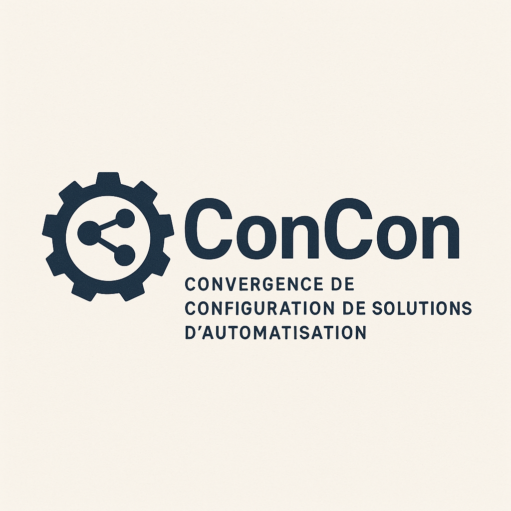

## ConCon (Convergence de Configuration)

**ConCon est une pratique DevOps visant à systématiquement réconcilier l'état réel d'une infrastructure avec sa "Source de Vérité" (le code), en traitant la dérive de configuration non pas comme une erreur, mais comme une source d'information.**

Ce dépôt est le foyer de ce concept. Il a pour but de définir, promouvoir et standardiser cette pratique essentielle à travers l'écosystème d'automatisation. Il s'adresse aux ingénieurs DevOps, SREs, administrateurs système et développeurs qui cherchent à construire des systèmes d'infrastructure plus robustes, transparents et anti-fragiles.

### Le Problème : La Dérive de Configuration

Dans un cycle de vie applicatif, les interventions manuelles créent une **dérive** entre l'environnement réel et le code, ce qui rend les déploiements futurs imprévisibles et fragiles. Cette dette technique silencieuse expose à des risques de sécurité, des pannes inattendues et une perte de connaissance institutionnelle.

### La Solution : La Pratique ConCon

ConCon formalise une solution en 4 étapes : **Détecter, Exporter, Transformer, Intégrer**. C'est un cycle vertueux qui transforme la dérive, une menace potentielle, en une opportunité d'amélioration continue.

* [**Lisez le Manifeste**](./MANIFESTO.md "null") pour comprendre la philosophie et les principes fondamentaux de ConCon.

* [**Explorez les Guides Pratiques**](./PRACTICES/ "null") pour découvrir comment appliquer ConCon avec vos outils favoris comme Helm, Terraform, et Ansible.

### Contribuer

Ce concept est ouvert et collaboratif. Si vous souhaitez améliorer les guides, ajouter des exemples pour de nouveaux outils ou faire évoluer le manifeste, veuillez lire notre [guide de contribution](./CONTRIBUTING.md "null").
